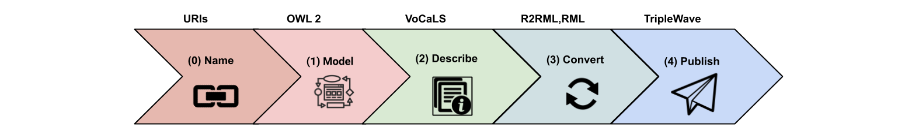

# GDELT Project Description

The Global Database of Events, Language & Tone [ (GDELT) project] (www.gdeltproject.org)
is a family of vast and heterogeneous Web Streams that is considered as the largest
open-access spatio-temporal archive for human society. Its Global Knowledge Graph spans
more than 215 years and connects people, organizations, locations, all over the world.
In particular, GDELT complex from a complex domain. It captures themes, images, and emotions
into a single holistic global network. GDELT data can be accessed via Google Big Query or via
a number APIs that run pre-defined analyses. Therefore, the interested researches are forced
to either run their analysis via the pay-per-use service or stick with the provided APIs.

# Publication Guidelines

## Step 0 - URI Design

We designed GDELT Stream URIs accordingly to [W3C recommendations](https://www.w3.org/TR/cooluris/#cooluris).

-  http://gdelt.stream/vocab# refers to GDELT native vocabulary (e.g. gdelt:Event, gdelt:Mention)
-  http://gdelt.stream/onto/cameo# refers to the OWL 2 version of the CAMEO ontology
-  http://gdelt.stream/onto/gcam# refers to the OWL 2 version of the GCAM ontology

-  http://gdelt.stream/ist/ refers to individual instances, e.g. an Actor or an Event
-  http://gdelt.stream/time refers to time instants

## Step 1 - Domain Modeling

 [CAMEO Ontology](./assets/ontologies/cameo.owl)

## Step 2 - Annotation and Conversion

## Step 3 - Publication

# GDELT Streams

- [Event Stream](./events-stream.html).
- [Mentions Stream](./mentions-stream.html).
- [GKG Stream](./gkg-stream.html).
